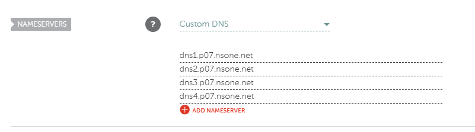

**[Netlify](//netlify.com)** makes it possible to add custom domains. 
Let's see how to add a domain registered in **[Namecheap](//namecheap.com)**.

Log in to **Netlify** account and go to the **Domain management** tab.

Then click button **Add custom domain** and put domain name to the field.

Verify you domain.

Go to the **Set up Netlify DNS**.

Verify domain owner.

**Netlify** will suggest some nameservers for your domain provider.

Log in to you **Namecheap** account and go to the your domain's **Manage** tab.

Find _**NAMESERVERS**_ section.

Select _**Custom DNS**_.

Add all nameservers provided with **Netlify**.

After adding **Netlify** verify DNS records ...

and add Let's Encript SSL certificate to your custom domain.

## Congrats!
These simple steps will help you to add custom **Namecheap** domain to the **Netlify** account for the few minutes.

